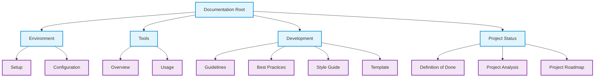
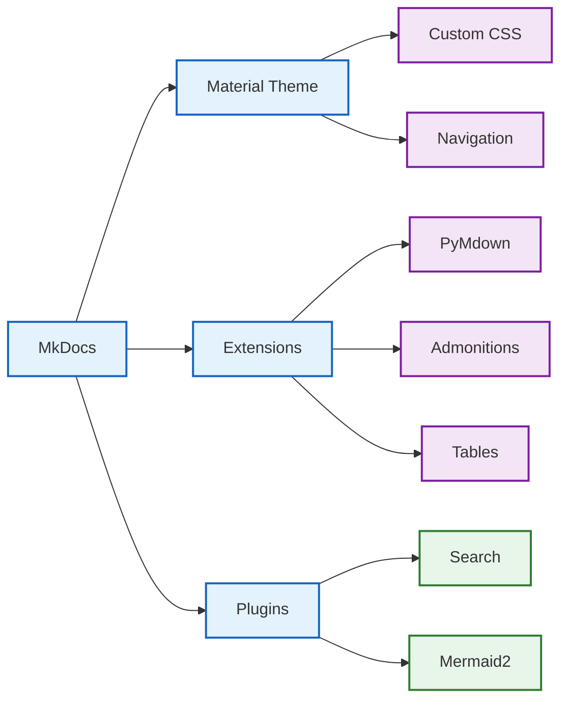
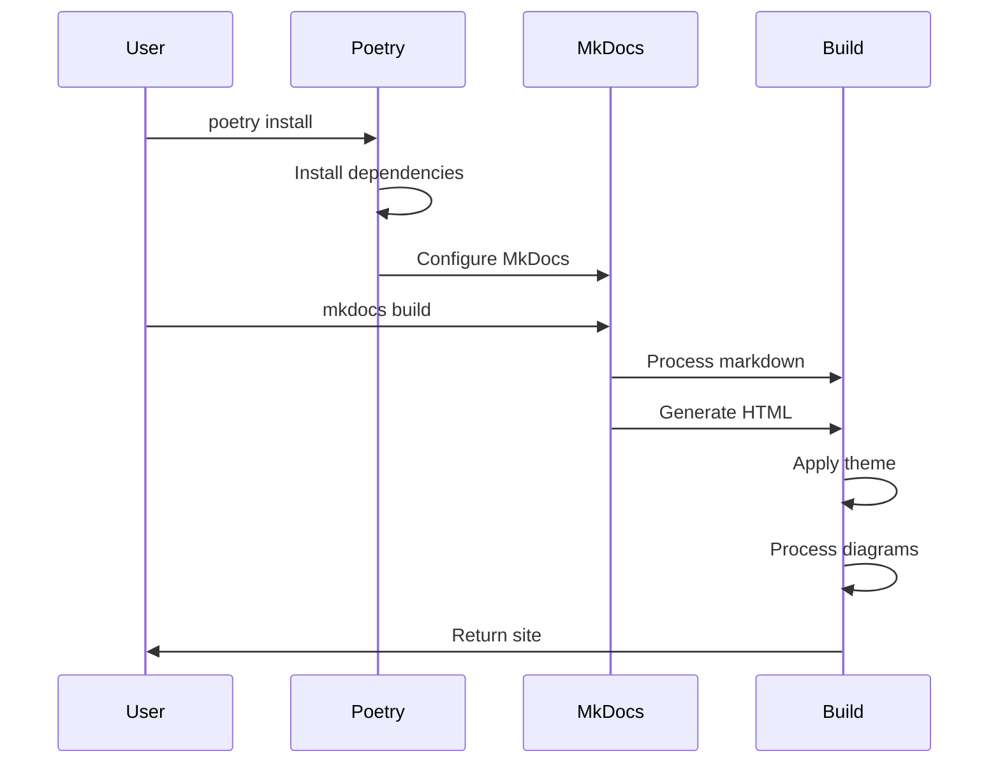
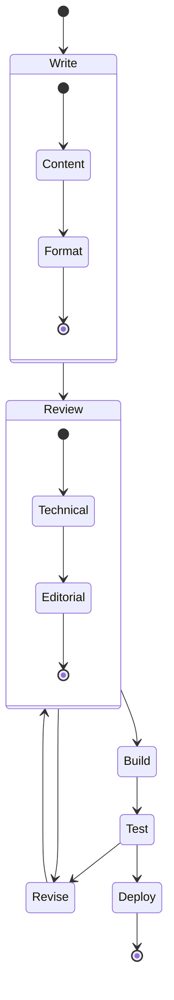

# Project Architecture

!!! difficulty "Intermediate"
    This document outlines the architecture of the Cascade Environment Documentation project.

## Documentation Structure

## Component Relationships

## Build Process

## Development Workflow

